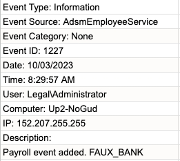
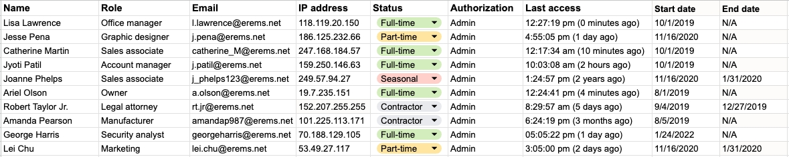

# 1. Scenario

You’re the first cybersecurity professional hired by a growing business.

Recently, a deposit was made from the business to an unknown bank account. 
The finance manager says they didn’t make a mistake. Fortunately, they were able to stop the payment. 
The owner has asked you to investigate what happened to prevent any future incidents.

To do this, you’ll need to do some accounting on the incident to better understand what happened. 
First, you will review the access log of the incident. Next, you will take notes that can help you identify a possible threat actor. 
Then, you will spot issues with the access controls that were exploited by the user. 
Finally, you will recommend mitigations that can improve the business' access controls and reduce the likelihood that this incident reoccurs.

# 2. Accounting Exercise

## 2.1 Event Log

## 2.2 Employee Directory

# 3. Access Control Worksheet

<table class="c13">
    <thead>
        <tr class="c17">
            <td class="c5" colspan="1" rowspan="1">
                

            </td>
            <td class="c6" colspan="1" rowspan="1">
                <h3 class="c8" id="h.rqizykdowjbx">Note(s)</h3>
            </td>
            <td class="c16" colspan="1" rowspan="1">
                <h3 class="c8" id="h.p472q8avw9cl">Issue(s)</h3>
            </td>
            <td class="c16" colspan="1" rowspan="1">
                <h3 class="c8" id="h.20luanqy86lg">Recommendation(s)</h3>
            </td>
        </tr>
    </thead>
    <tbody></tbody>
    <tbody>
        <tr class="c23">
            <td class="c21" colspan="1" rowspan="1">
                
Authorization /authentication

            </td>
            <td class="c6" colspan="1" rowspan="1">
                
Objective:&nbsp;Make 1-2 notes of
                        information that can help identify the threat:

                <ul class="c14 lst-kix_h2rh1gbxufbr-0 start">
                    <li class="c9 li-bullet-0">The event took place on 10/03/23.</li>
                    <li class="c9 li-bullet-0">The user is Legal/Administrator.</li>
                    <li class="c9 li-bullet-0">The IP address of the computer used to login is
                            152.207.255.255.</li>
                </ul>
            </td>
            <td class="c16" colspan="1" rowspan="1">
                
Objective:&nbsp;Based on your notes, list
                        1-2 authorization issues:

                <ul class="c14 lst-kix_ir5owlcl497k-0 start">
                    <li class="c9 li-bullet-0">Robert Taylor Jr is an admin.</li>
                    <li class="c9 li-bullet-0">His contract ended in 2019, but his account
                            accessed payroll systems in 2023. </li>
                </ul>
            </td>
            <td class="c16" colspan="1" rowspan="1">
                
Objective:&nbsp;Make at least 1
                        recommendation that could prevent this kind of incident:

                <ul class="c14 lst-kix_2pj5rwi68u3s-0 start">
                    <li class="c9 li-bullet-0">User accounts should expire after 30 days.
                    </li>
                    <li class="c9 li-bullet-0">Contractors should have limited access to business
                            resources.</li>
                    <li class="c9 li-bullet-0">Enable MFA.</li>
                </ul>
            </td>
        </tr>
    </tbody>
</table>
