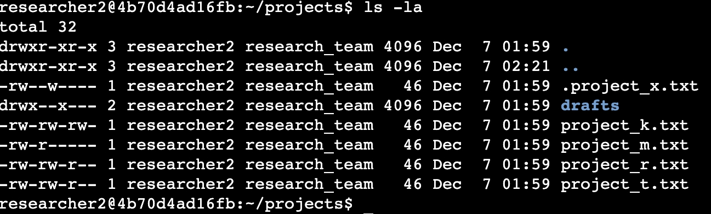
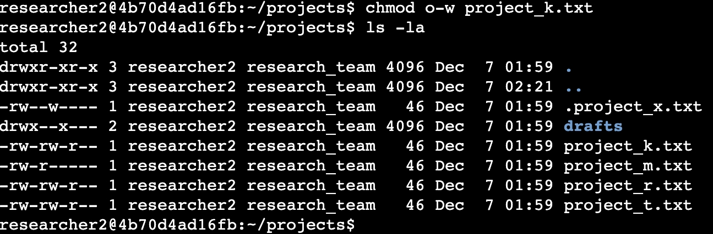
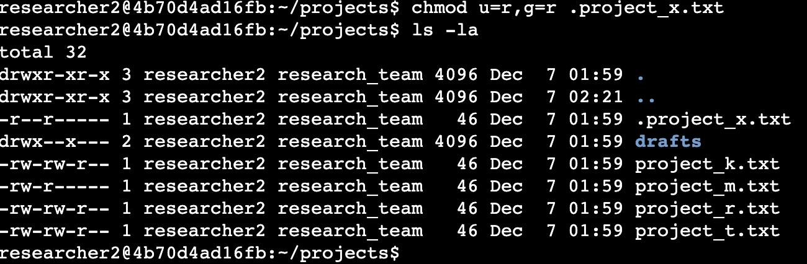
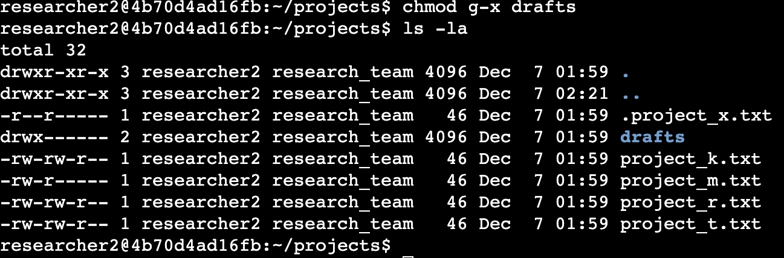

# File permissions in Linux

### Project description
The research team at my organization has tasked me with checking and updating the existing permissions on the files and directories within the projects directory. The permissions currently do not match the authorization that should be given. Modifying the permissions is needed to authorize the appropriate users and remove any authorized access. To complete this task, I performed following tasks:

### Check file and directory details
I used following Linux commands to determine existing permissions for the projects directory in the file system.

The first line of the screenshot is the command I entered and following lines are output by the system. The code ls -la displays all the contents of the projects directory. I used ls command with -la argument, where l displays detailed listing of file contents and a displays hidden files. The output shows that there is one hidden file named .project_x.txt, one directory drafts and four other project files. The 10-character string on the first part of list is the permissions string displaying permissions set on each file or directory.

### Describe the permissions string
The 10-character string can be deconstructed to determine who is authorized to access the file and their specific permissions. The characters and what they represent are as follows:

* 1st character: This character is either a d or hyphen (-) and indicates the file type. If it’s a d, it’s a directory. If it’s a hyphen (-), it’s a regular file.
* 2nd-4th characters: These characters indicate the read (r), write (w), and execute (x) permissions for the user. When one of these characters is a hyphen (-) instead, it indicates that this permission is not granted to the user.
* 5th-7th characters: These characters indicate the read (r), write (w), and execute (x) permissions for the group. When one of these characters is a hyphen (-) instead, it indicates that this permission is not granted for the group.
* 8th-10th characters: These characters indicate the read (r), write (w), and execute (x) permissions for other. This owner type consists of all other users on the system apart from the user and the group. When one of these characters is a hyphen (-) instead, that indicates that this permission is not granted for other.

For example, the file permissions for project_t.txt are -rw-rw-r--. Since the first character is a hyphen (-), this indicates that project_t.txt is a file, not a directory. The second, fifth, and eighth characters are all r, which indicates that user, group, and other all have read permissions. The third and sixth characters are w, which indicates that only the user and group have write permissions. No one has execute permissions for project_t.txt.

### Change file permissions
The organization determined that other shouldn't have write access to any of their files. To comply with this, I referred to the file permissions that I previously returned. I determined project_k.txt must have the write access removed for other.

The following code demonstrates how I used Linux commands to do this:

The first two lines of the screenshot display the commands I entered, and the other lines display the output of the second command. The chmod command changes the permissions on files and directories. The first argument indicates what permissions should be changed, and the second argument specifies the file or directory. In this example, I removed write permissions from other for the project_k.txt file. After this, I used ls -la to review the updates I made.

### Change file permissions on a hidden file
The research team at my organization recently archived project_x.txt. They do not want anyone to have write access to this project, but the user and group should have read access. 

The following code demonstrates how I used Linux commands to change the permissions:

The first two lines of the screenshot display the commands I entered, and the other lines display the output of the second command. I know .project_x.txt is a hidden file because it starts with a period (.). In this example, I set read permissions for both the user and group with u=r,g=r. 

### Change directory permissions
My organization only wants the researcher2 user to have access to the drafts directory and its contents. This means that no one other than researcher2 should have execute permissions.

The following code demonstrates how I used Linux commands to change the permissions:

The output here displays the permission listing for several files and directories. Line 1 indicates the current directory (projects), and line 2 indicates the parent directory (home). Line 3 indicates a regular file titled .project_x.txt. Line 4 is the directory (drafts) with restricted permissions. Here you can see that only researcher2 has execute permissions.  It was previously determined that the group had execute permissions, so I used the chmod command to remove them.

### Summary
I updated thepermissions to match the required authorization by my organization for files and directories in the projects directory. The first step in this was using ls -la to check the permissions for the directory. This informed my decisions in the following steps. I then used the chmod command multiple times to change the permissions on files and directories.

# File permissions in Linux

### Project description
The research team at my organization has tasked me with checking and updating the existing permissions on the files and directories within the projects directory. The permissions currently do not match the authorization that should be given. Modifying the permissions is needed to authorize the appropriate users and remove any authorized access. To complete this task, I performed following tasks:

### Check file and directory details
I used following Linux commands to determine existing permissions for the projects directory in the file system.

The first line of the screenshot is the command I entered and following lines are output by the system. The code ls -la displays all the contents of the projects directory. I used ls command with -la argument, where l displays detailed listing of file contents and a displays hidden files. The output shows that there is one hidden file named .project_x.txt, one directory drafts and four other project files. The 10-character string on the first part of list is the permissions string displaying permissions set on each file or directory.

### Describe the permissions string
The 10-character string can be deconstructed to determine who is authorized to access the file and their specific permissions. The characters and what they represent are as follows:

* 1st character: This character is either a d or hyphen (-) and indicates the file type. If it’s a d, it’s a directory. If it’s a hyphen (-), it’s a regular file.
* 2nd-4th characters: These characters indicate the read (r), write (w), and execute (x) permissions for the user. When one of these characters is a hyphen (-) instead, it indicates that this permission is not granted to the user.
* 5th-7th characters: These characters indicate the read (r), write (w), and execute (x) permissions for the group. When one of these characters is a hyphen (-) instead, it indicates that this permission is not granted for the group.
* 8th-10th characters: These characters indicate the read (r), write (w), and execute (x) permissions for other. This owner type consists of all other users on the system apart from the user and the group. When one of these characters is a hyphen (-) instead, that indicates that this permission is not granted for other.

For example, the file permissions for project_t.txt are -rw-rw-r--. Since the first character is a hyphen (-), this indicates that project_t.txt is a file, not a directory. The second, fifth, and eighth characters are all r, which indicates that user, group, and other all have read permissions. The third and sixth characters are w, which indicates that only the user and group have write permissions. No one has execute permissions for project_t.txt.

### Change file permissions
The organization determined that other shouldn't have write access to any of their files. To comply with this, I referred to the file permissions that I previously returned. I determined project_k.txt must have the write access removed for other.

The following code demonstrates how I used Linux commands to do this:

The first two lines of the screenshot display the commands I entered, and the other lines display the output of the second command. The chmod command changes the permissions on files and directories. The first argument indicates what permissions should be changed, and the second argument specifies the file or directory. In this example, I removed write permissions from other for the project_k.txt file. After this, I used ls -la to review the updates I made.

### Change file permissions on a hidden file
The research team at my organization recently archived project_x.txt. They do not want anyone to have write access to this project, but the user and group should have read access. 

The following code demonstrates how I used Linux commands to change the permissions:

The first two lines of the screenshot display the commands I entered, and the other lines display the output of the second command. I know .project_x.txt is a hidden file because it starts with a period (.). In this example, I set read permissions for both the user and group with u=r,g=r. 

### Change directory permissions
My organization only wants the researcher2 user to have access to the drafts directory and its contents. This means that no one other than researcher2 should have execute permissions.

The following code demonstrates how I used Linux commands to change the permissions:

The output here displays the permission listing for several files and directories. Line 1 indicates the current directory (projects), and line 2 indicates the parent directory (home). Line 3 indicates a regular file titled .project_x.txt. Line 4 is the directory (drafts) with restricted permissions. Here you can see that only researcher2 has execute permissions.  It was previously determined that the group had execute permissions, so I used the chmod command to remove them.

### Summary
I updated thepermissions to match the required authorization by my organization for files and directories in the projects directory. The first step in this was using ls -la to check the permissions for the directory. This informed my decisions in the following steps. I then used the chmod command multiple times to change the permissions on files and directories.

