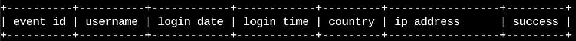
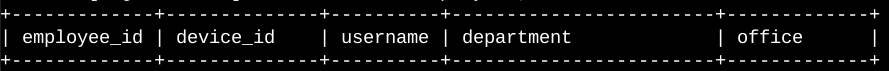

# Table formats

This document describes how the tables used for this portfolio activity are organized. The organization database contains the following two tables: 

* log\_in\_attempts  
* employees

## log\_in\_attempts

The **log\_in\_attempts** table has the following columns:

* event\_id: The identification number assigned to each login event  
* username: The username of the employee  
* login\_date: The date the login attempt was recorded  
* login\_time: The time the login attempt was recorded  
* country: The country where the login attempt occurred  
* ip\_address: The IP address of that employee’s machine  
* success: The success of the login attempt; FALSE indicates a failed attempt

In the MariaDB shell, these columns are returned as:  

## employees

The **employees** table has the following columns:

* employee\_id: The identification number assigned to each employee  
* device\_id: The identification number assigned to each device used by the employee  
* username: The username of the employee  
* department: The department the employee is in  
* office: The office the employee is located in

In the MariaDB shell, these columns are returned as:  

