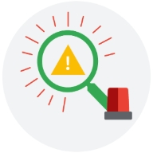

# Incident Handler's Journal

<table>
    <tr>
        <td>
            <h4>Date:</h4>
            
12/21/2024

        </td>
        <td>
            <h4>Entry:</h4>
            
#001

        </td>
    </tr>
    <tr>
        <td>Description</td>
        <td>Incident log of the ransomware attack on a health care clinic.</td>
    </tr>
    <tr>
        <td>Tool(s) used</td>
        <td>None</td>
    </tr>
    <tr>
        <td>The 5 W's</td>
        <td>
            
Capture the 5 W's of an incident.

            <ul>
                <li>Who caused the incident?</li>
                <ul><li>An organized group of unethical hackers</li></ul>
                <li>What happened?</li>
                <ul><li>A ransomware security incident using phishing attack</li></ul>
                <li>When did the incident occur?</li>
                <ul><li>Tuesday at 9:00 a.m.</li></ul>
                <li>Where did the incident occur?</li>
                <ul><li>At a U.S. health care company</li></ul>
                <li>Why did the incident happen?</li>
                <ul><li>The security incident happened because an organized group of unethical hackers were able to access the health care company's systems using a phishing attack. After gaining access, the attackers launched their ransomware on the company's computers which encrypted critical files. The attackers' motivation appears to be financial as a ransom note was displayed on computers demanding large sum of money in exchange for the decryption key.</li></ul>
            </ul>
        </td>
    </tr>
    <tr>
        <td>Additional notes</td>
        <td>
            <ul>
                <li>It is important to investigate how the attackers managed to send the phishing emails to multiple employees of the company.</li>
                <li>Should the company pay the ransom to get the decryption key?</li>
                <li>How can the company prevent an incident like this from happening again in future?</li>
            </ul>
        </td>
    </tr>
</table>