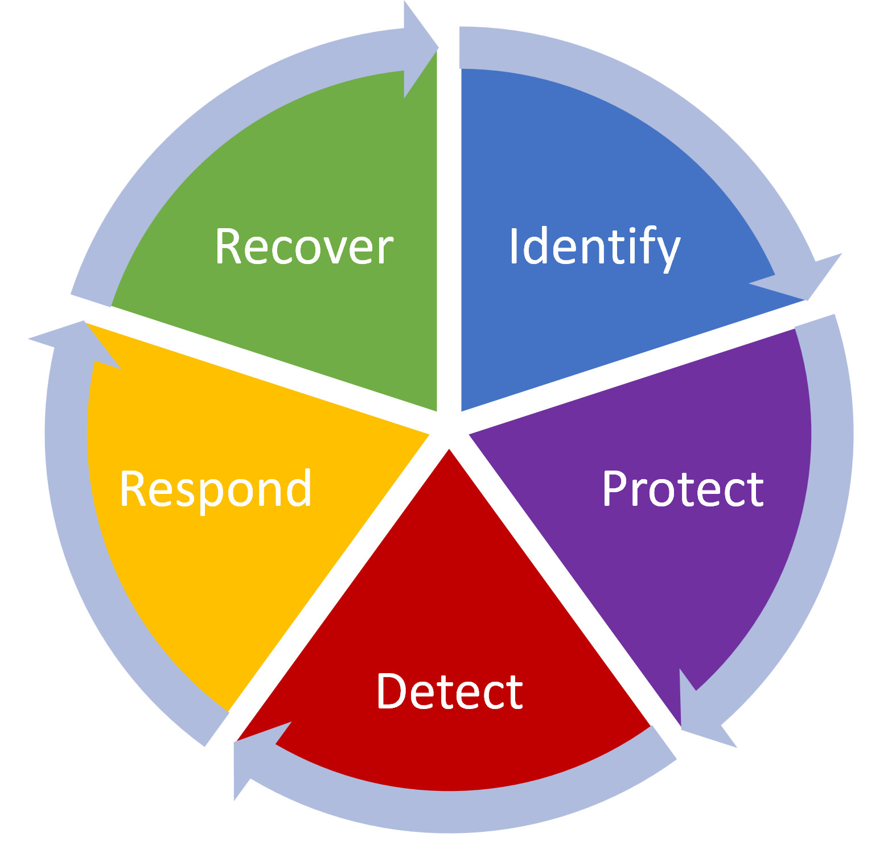

**Applying the NIST CSF**

Earlier in this program you learned about the uses and benefits of the National Institute of Standards and Technology (NIST) Cybersecurity Framework (CSF). 
There are five core functions of the NIST CSF framework: identify, protect, detect, respond, and recover.

*Image: 5 core functions of the NIST CSF*

These core functions help organizations manage cybersecurity risks, implement risk management strategies, and learn from previous mistakes. 
Plans based on this framework should be continuously updated to stay ahead of the latest security threats. 
The core functions help ensure organizations are protected against potential threats, risks, and vulnerabilities. Each function can be used to improve an organization’s security: 

* **Identify:** Manage security risks through regular audits of internal networks, systems, devices, and access privileges to identify potential gaps in security. 

* **Protect**: Develop a strategy to protect internal assets through the implementation of policies, procedures, training and tools that help mitigate cybersecurity threats. 

* **Detect**: Scan for potential security incidents and improve monitoring capabilities to increase the speed and efficiency of detections. 

* **Respond**: Ensure that the proper procedures are used to contain, neutralize and analyze security incidents and implement improvements to the security process. 

* **Recover**: Return affected systems back to normal operation and restore systems data and assets that have been affected by an incident. 

Some questions to ask for each of the five core functions, include:

The NIST CSF and its five core functions provide a framework of planning proactive to applying reactive measures to cybersecurity threats. 
These functions are essential for ensuring that an organization has effective security strategies in place. 
An organization must have the ability to quickly recover from any damage caused by an incident to minimize their level of risk. 
