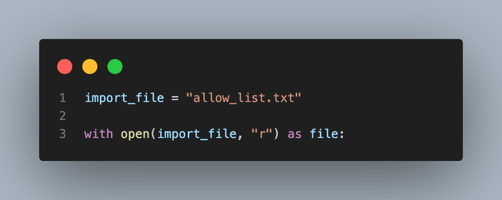
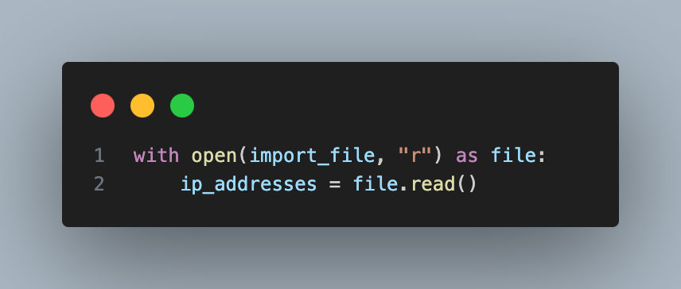
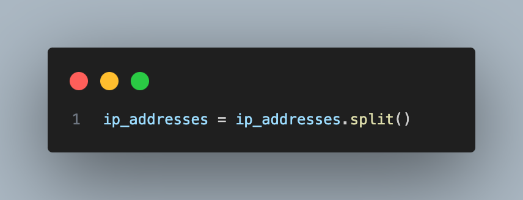
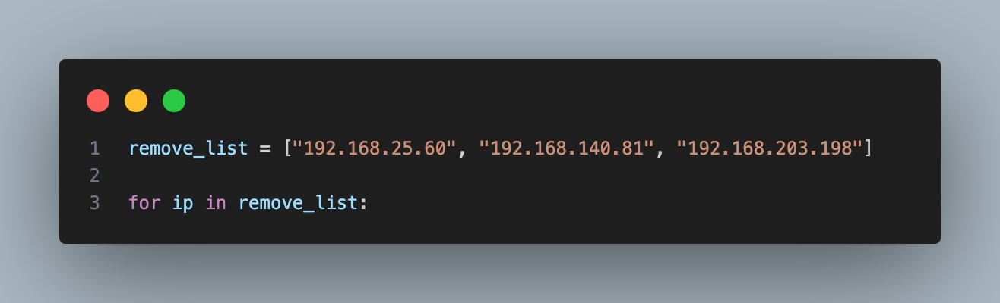
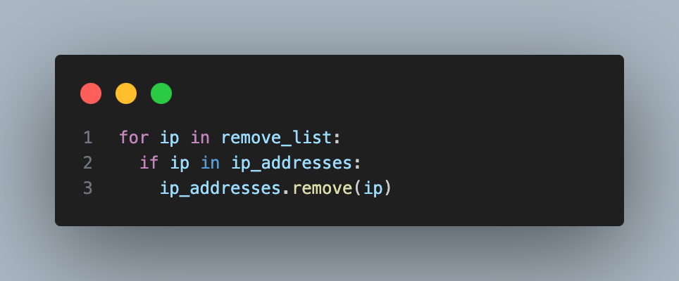
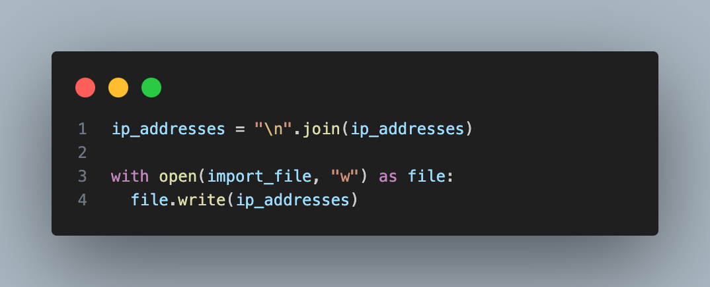
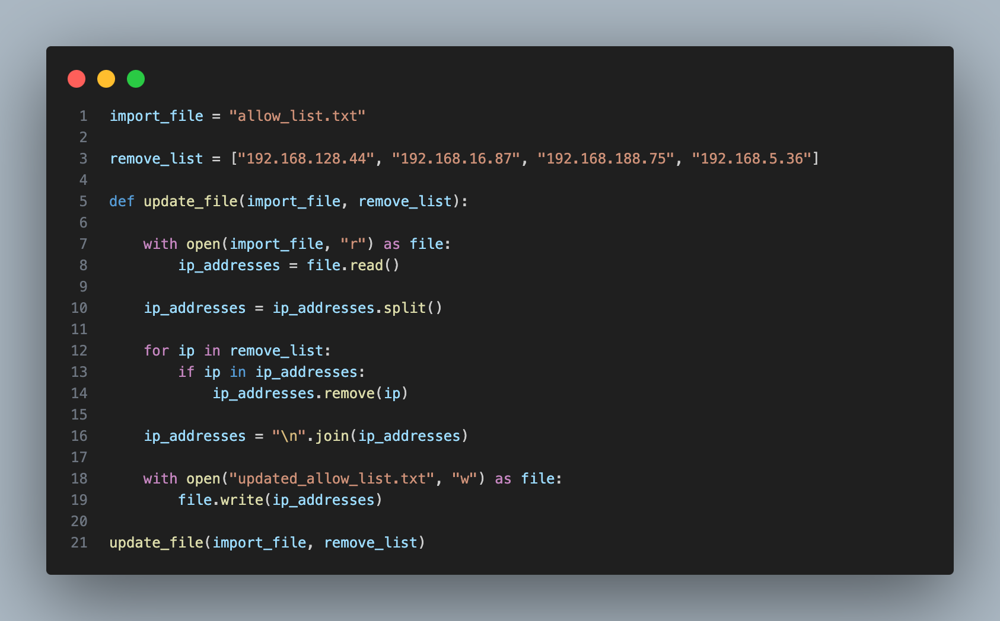

# Updating an Allow List File with a Python Algorithm

## Project Overview

In my organization, access to restricted content is managed using an allow list of IP addresses stored in the `allow_list.txt` file. 
A separate remove list identifies IP addresses that should no longer have access. 
To automate the process of updating this file, I developed a Python algorithm that removes the specified IP addresses from the allow list.

## Opening the `allow_list.txt` File

To begin, I assigned the file name `allow_list.txt` to the `import_file` variable. Then, I used a `with` statement to open the file in read mode (`"r"`). 
This ensures that the file closes automatically after use, preventing resource leaks. The file's content is stored in a variable for further processing.

## Reading File Contents

Once the file is opened, I used the `.read()` method to convert its contents into a string. This allows me to process the IP addresses as text data. 
The string output is assigned to the `ip_addresses` variable for further manipulation.

## Converting the String into a List

Since I need to remove specific IP addresses, I converted the string into a list using the `.split()` method. This splits the text at whitespace, making it easier to manage individual IP addresses.

## Iterating Through the Remove List

To remove IP addresses, I used a `for` loop to iterate over `remove_list`. This loop ensures that every IP address listed for removal is checked against the allow list.

## Removing IP Addresses

Within the loop, I applied a conditional statement to check if each IP address from `remove_list` is present in `ip_addresses`. 
If found, I used the `.remove()` method to delete it. This prevents errors that could arise from attempting to remove non-existent elements.

## Updating the Allow List File

After removing the specified IP addresses, I converted the list back into a string using `.join()`. Each element is separated by a newline (`"\n"`) to maintain proper formatting.

Finally, I used another `with` statement to open `allow_list.txt` in write mode (`"w"`). 
The `.write()` method then updates the file with the modified list, ensuring that restricted content is no longer accessible to the removed IP addresses.

## Summary

This Python algorithm efficiently updates the `allow_list.txt` file by:
- Reading the file's contents
- Converting it into a manageable list format
- Iterating through a list of IP addresses to be removed
- Removing matched IP addresses from the list
- Writing the updated list back to the file

By automating this process, I ensure that the allow list remains accurate and up to date, improving security and access management.

